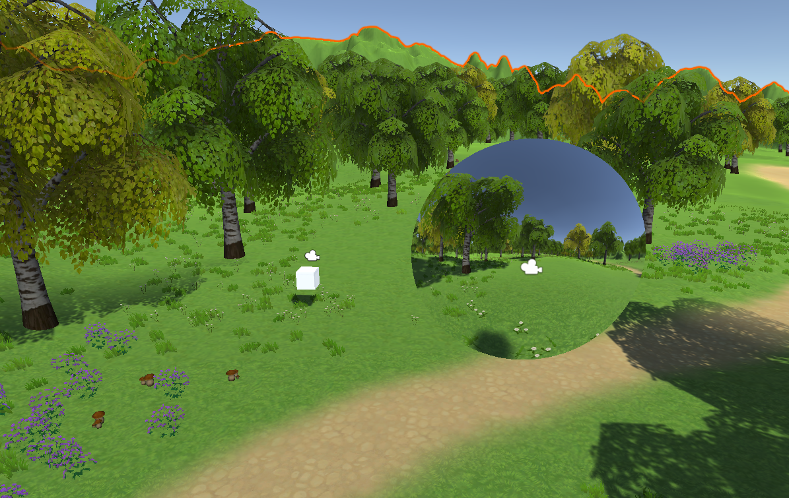
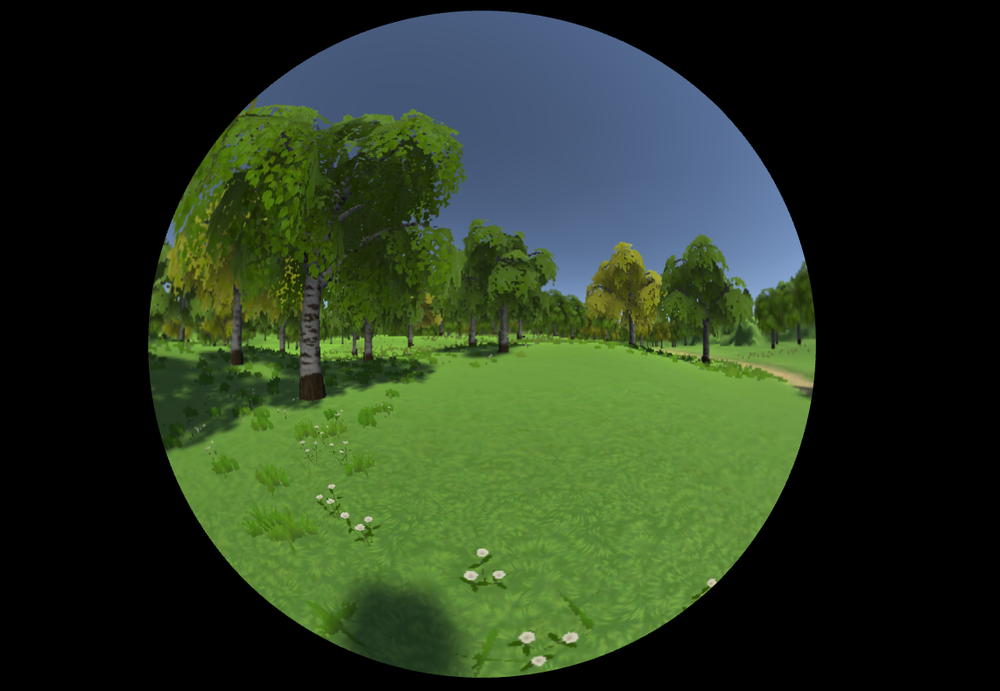

# Unity Fisheye Camera Example
This is a sample code for make a fisheye camera (orthographic projection) in Unity.

## Quick Start
1. Open *TestScene*.
2. You can move character with WSAD keys.
3. Fisheye camera view is rendered to Display 2.

## More Information
You need to make mesh objects to create a fisheye camera in Unity. Please see [*fisheye mesh generator*](https://github.com/KeunwooPark/fisheye_mesh_generator) and [this document](https://www.notion.so/keunwoopark/Fisheye-Mesh-Generator-How-Does-It-Work-e7ccf209708041e4aec295d53567cced).
